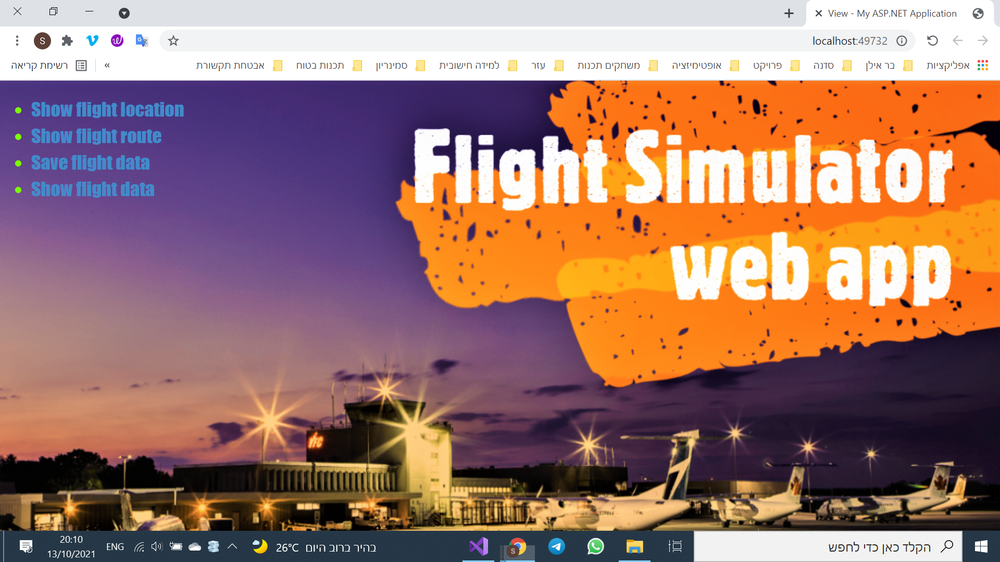
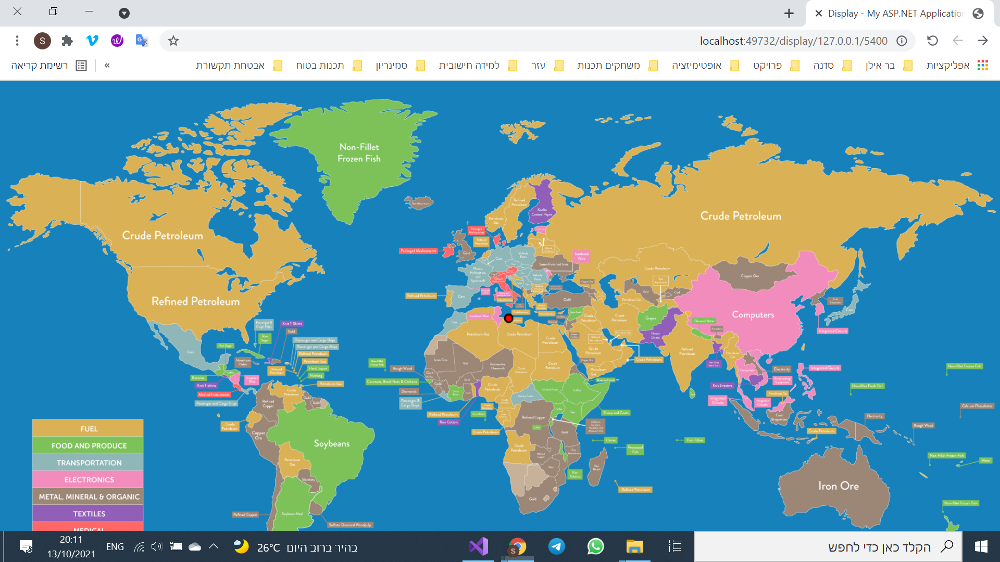
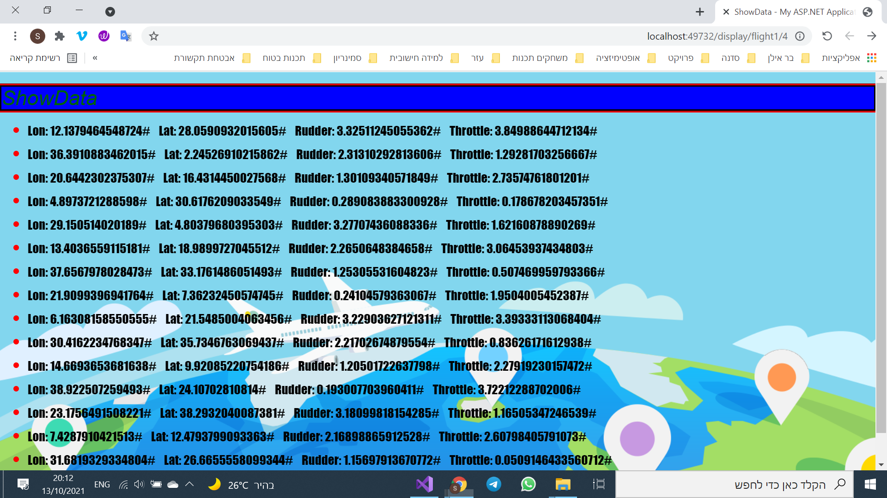

# FlightSimulator-web-app

A web application that receives data from a flight simulator and displays the location of the plane on a map, as well as storing the data it receives from the flight simulator.
#### It was developed using C# programming language and the MVC design pattern
.
**Snapshots**

-----------------------------
